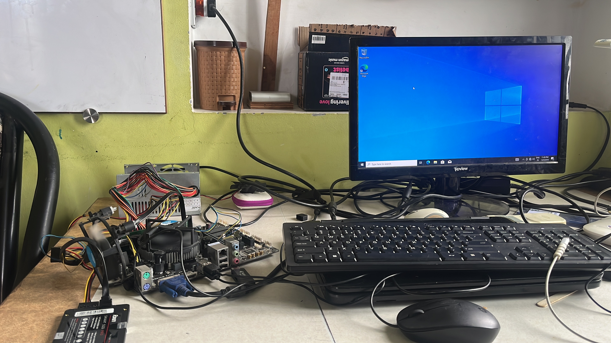
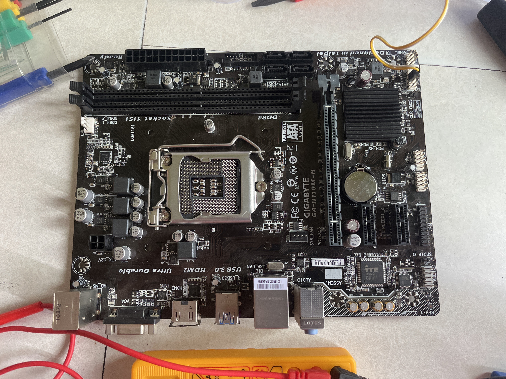
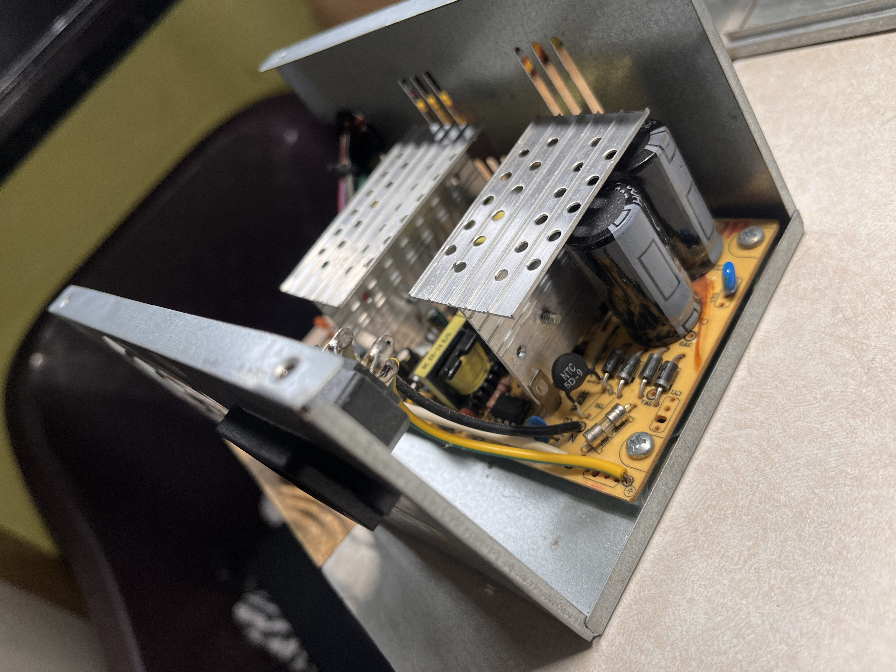
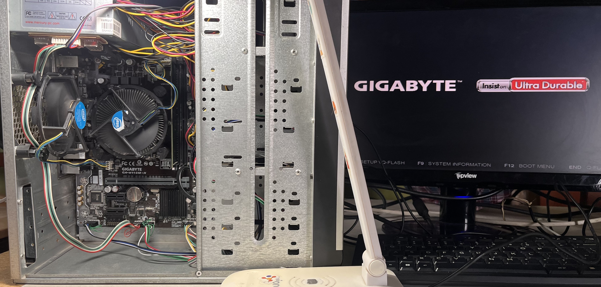

# 🛠️ Scrap PC Rebuild: From Junkyard to TrueNAS Server

<i>First boot: salvaged board, CPU, RAM and repaired power supply running open on the bench.</i>

**A hands-on rebuild of a non-functional PC using e-waste, and turning it into a functioning server.**  
Built by a first-year CS student, this project documents the step-by-step revival of discarded components — including motherboard, CPU, PSU, RAM, and HDD — and explains the process of recovering lost data, soldering high-voltage parts, flashing BIOS, and setting up a basic home server using Tailscale.

---

## 💡 Objective

> Can I take a pile of broken, discarded parts — bent pins, blown capacitors, corrupted drives — and turn them into a working system with real-world value?

---

## 🔩 Hardware Used (All Recycled or Repaired)

| Component               | Status Before Rebuild             | Final Use Case              |
|------------------------|------------------------------------|-----------------------------|
| Gigabyte GA-H110M-H    | Bent CPU socket pins               | Fixed and bootable          |
| Intel Core i3-6098P    | Used, untested                     | Working processor           |
| Mercury PSU            | Swollen 450V capacitor             | Capacitor replaced, stable  |
| 500GB HDD              | No partitions, unreadable          | 200GB data recovered        |
| RAM (4GB DDR4)         | Salvaged from scrap build          | Bootable and stable         |
| Cabinet, USB headers   | From junkyard                      | Refitted, rewired           |

---

## 🧠 Build Process (Step-by-Step)

### 🔧 Step 1: Motherboard Repair

- Realigned >6 bent CPU socket pins using tweezers
- Used multimeter for continuity testing
- Checked for short circuits between lanes

### ❄️ Step 2: CPU + Cooling
- Cleaned CPU and socket
- Applied thermal paste (Zebronics silver)
- Mounted fan and heatsink from old board

### ⚡ Step 3: PSU Repair (High Voltage Safety)

- Discharged power before handling
- Desoldered 450V capacitor and replaced with working one
- Insulated gloves + safety checks throughout
- Measured voltage rails with multimeter before connection

### 💻 Step 4: BIOS Reset & Flash
- Reset CMOS using jumper + battery method
- Flashed fresh BIOS from Gigabyte using @BIOS utility

### 🧰 Step 5: System Assembly

- Connected front panel headers (F-panel, USB, audio)
- Managed SATA, power, and internal cables for airflow
- Added external USB hub to replace broken USB ports

### 🖥️ Step 6: OS Installation
- Created bootable USB via Windows Media Creation Tool
- Installed Windows 10 cleanly

---

## 💾 Step 7: Data Recovery from Formatted Disk

### Problem:
> HDD showed no partitions, and was believed fully corrupted.

### Tools:
- [`TestDisk`](https://www.cgsecurity.org/wiki/TestDisk)
- [`PhotoRec`](https://www.cgsecurity.org/wiki/PhotoRec)

### What I Did:
- Scanned each **cylinder** with TestDisk to detect boot sectors or partition remnants
- Used PhotoRec to recover files **at bit-level** using signature scanning
- Successfully recovered **200GB of family photos and videos** that were considered lost

---

## 🌐 Step 8: Server Setup (Made Simple)

- Installed [**Tailscale**](https://tailscale.com) for secure mesh VPN access
- Enabled Windows Advanced Sharing
- Shared folders accessible from any device over internet with Tailscale
- No need for port forwarding or public IP

> ✅ Secure  
> ✅ Easy  
> ✅ Works globally

---

## ✅ Final Outcome

| Feature                     | Status                |
|----------------------------|------------------------|
| Bootable, stable PC        | ✅                     |
| Data Recovery (200GB+)     | ✅                     |
| Secure remote access       | ✅ (via Tailscale)     |
| Recycled PSU + Case        | ✅                     |

---

## 🔄 Next Steps

- Replace Windows with **TrueNAS SCALE**
- Run **ZFS** and experiment with **Docker containers**
- Setup remote backup, NAS automation, and home lab services

---

## 🧰 Tools Used

| Tool / Component          | Purpose                                  |
|--------------------------|------------------------------------------|
| TestDisk + PhotoRec      | Partition + raw data recovery            |
| Multimeter               | Circuit testing + pin continuity         |
| Soldering Iron (450V)    | Capacitor replacement in PSU             |
| Thermal Paste            | CPU cooling                              |
| BIOS Flash Utility       | Firmware reset                           |
| Tailscale                | Global, private networking                |
| Windows Boot Tool        | USB OS installation                      |

---

## 👨‍💻 About the Builder

> Hi! I’m a first-year CS student exploring hands-on hardware, open-source recovery tools, and home server automation.  
> This was a weekend project turned full-scale learning journey.

---

## 🤝 Contributions

Feel free to open an Issue or PR if you'd like to:
- Share build improvements
- Suggest alternate tools
- Add TrueNAS or Docker configuration once I post it

---

## 🧠 Key Takeaways

> 🔧 Fix broken things.  
> ♻️ Use what you have.  
> 🧠 Learn by doing.  
> 📖 Then share it with the world.

📩 Need Help with Data Recovery?

If you’ve got a hard drive that isn’t physically broken but has lost partitions, shows as “unallocated,” or has accidentally deleted files — I can try to help you recover your data using open-source tools and safe methods.

👉 Reach out at: zanyanbuchelvan@gmail.com

---

### License

Open-source under MIT. Share, remix, fork — and don’t forget to document your version!

---

#pcbuild #hardware #truNAS #recovery #opensource #tailscale #testdisk #scraptoproductive #learningbydoing

